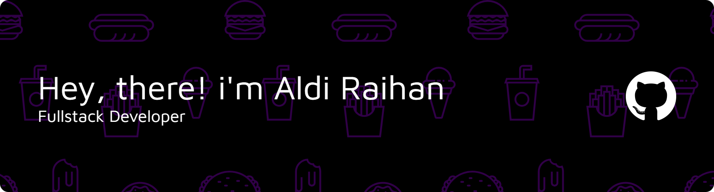

  

  

<h2 align="center" style="margin-top:50px">🛠️ Tech Stack</h2>

  

<h2 align="center" style="margin-top:50px">📊 GitHub Stats</h2>

  <!-- Custom clean theme: dark grey bg (2D333B), cream text (F5E6D3), violet accents (7C3AED) -->
  
  

  <!-- Most Used Languages with matching clean theme -->
  

<h2 align="center" style="margin-top:50px">📈 Contribution Activity</h2>

  <picture>
    <source media="(prefers-color-scheme: dark)" srcset="https://raw.githubusercontent.com/Aldayanday1/Aldayanday1/output/snake-dark.svg">
    <source media="(prefers-color-scheme: light)" srcset="https://raw.githubusercontent.com/Aldayanday1/Aldayanday1/output/snake.svg">
    
  </picture>

<h2 align="center">📫 Connect with Me</h2>

  
  
  

